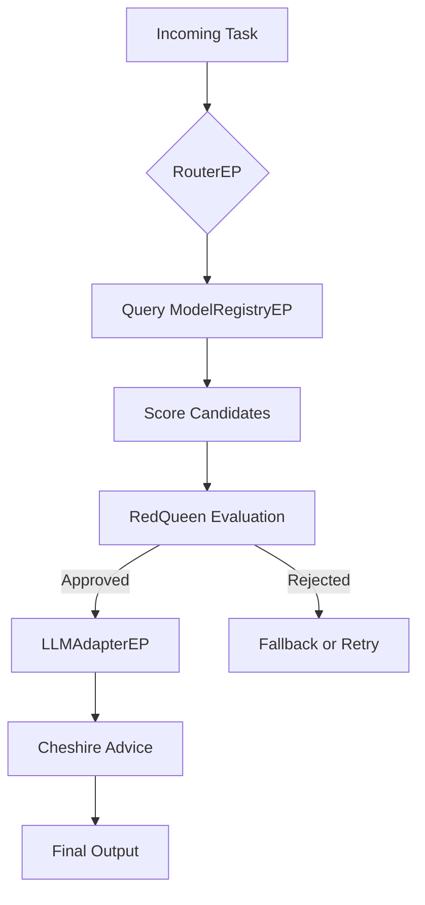

# 🧠 From ACI to CCI: A Fractal Offloading Architecture for Distributed Intelligence

## Overview

This document defines the complete design for a system that evolves an Artificial Collective Intelligence (ACI) architecture into a **Collective Compute Intelligence (CCI)**—a fractal, distributed mesh of intelligent clusters that can dynamically offload tasks across local and remote LLMs, ML models, or entire ACI clusters. This version includes the full update to replace AutoGen with a dynamic RouterEP-based micro-model architecture.

------

## 🎯 Core Concept

> When an ACI becomes recursive and composable at scale, it transcends into **CCI**.

Each ACI becomes both:

- An **Entity Program (EP)** to a higher-level orchestrator
- And a **Master Control Program (MCP)** over its own specialized EPs

This enables **fractal orchestration**, **dynamic offloading**, and **shared compute intelligence** across devices, clouds, or edge networks.

------

## 🧩 System Architecture

### Components

| Component            | Description                                                  |
| -------------------- | ------------------------------------------------------------ |
| **RouterEP (MCP)**   | Replaces AutoGen with dynamic task routing using real-time metadata from a model registry |
| **EP**               | A pure function: data in → data out. Can be atomic (LoRA, ML, heuristic) or composite (an entire ACI) |
| **ACI Cluster**      | A group of EPs + an MCP; exposes itself as a single EP to external systems |
| **LLMAdapterEP**     | Wraps remote/local LLMs (OpenAI, LM Studio, xLSTM, TinyLlama, SmolLM2) |
| **ModelRegistryEP**  | Catalog of all EPs with metadata (latency, accuracy, model ID, tasks) |
| **RedQueen**         | Policy enforcer, approval gatekeeper, failover logic         |
| **WhiteRabbit**      | API/EP scanner, new endpoint discovery, feeds RedQueen       |
| **MadHatter**        | Adversarial fuzzing, stress-testing and failure simulations  |
| **Cheshire**         | Trust advisor, output evaluator, cognitive sanity checker    |
| **CaterpillarAlice** | Meta-governance layer to keep RedQueen in check              |

------

## 🔌 Offloading Design

### Offload Decision Flow



### Example Request

```json
POST /dispatch_task
{
  "task_type": "summarization",
  "context": "Meeting transcript...",
  "preferred_targets": ["local:xLSTM", "openai:gpt-4", "peer_aci:beta"]
}
```

------

## ⚙️ EP Definitions

### Local xLSTM EP

```json
{
  "ep_id": "local:xLSTM",
  "model": "xLSTM-7B",
  "quantized": true,
  "lora": "summary_v3",
  "max_tokens": 512,
  "latency": "fast"
}
```

### Remote LLM EP (e.g., OpenAI)

```json
{
  "ep_id": "openai:gpt-4",
  "endpoint": "https://api.openai.com/v1/chat/completions",
  "headers": { "Authorization": "Bearer $OPENAI_KEY" },
  "context_adapter": true,
  "fallback": false
}
```

### Fractal ACI Registration

```json
POST /register_cluster
{
  "cluster_id": "peer_aci:beta",
  "mcp_url": "http://10.0.0.2:8000",
  "capabilities": ["summarization", "qa", "context_injection"],
  "heartbeat_url": "/health"
}
```

### Model Registry Entry

```json
{
  "model_id": "TinyLlama-1.1B",
  "ep_id": "local:tinyllama",
  "tasks": ["qa", "rewrite"],
  "latency": 200,
  "accuracy": 0.83,
  "memory_footprint": "1.5GB"
}
```

------

## 🧠 Governance and Alignment

### Agent Roles

| Agent                  | Function                                         |
| ---------------------- | ------------------------------------------------ |
| 🐇 **WhiteRabbit**      | Discovers, tests, and registers new EPs & APIs   |
| 🎩 **MadHatter**        | Fuzzes, mutates, and adversarially tests EPs     |
| 😼 **Cheshire**         | Trust score generator, outputs alignment advice  |
| 👑 **RedQueen**         | Enforces policy, validates offload decisions     |
| 🐛 **CaterpillarAlice** | Meta-governor, oversees RedQueen’s bias/rigidity |

### Interactions

- RedQueen can reject or approve model candidates
- CaterpillarAlice monitors routing fairness, bias trends, fallback loops
- MadHatter can simulate sabotage or prompt drift
- Cheshire scores outputs before user delivery

------

## 🧬 Fractal Evolution → CCI

When multiple ACI networks **form clusters**, and clusters route tasks between each other via shared MCP interfaces, the network becomes a **fractal mesh of cognition**:

- New devices can join and contribute EPs (compute + intelligence)
- Each cluster functions autonomously *and* composably
- LLMs, ML, heuristics, and memory combine fluidly

> This is **Collective Compute Intelligence (CCI)**: the evolutionary leap beyond AGI or standalone agents.

------

## ✅ Next Actions

- Scaffold RouterEP, AdapterEPs, and `register_cluster` handler
- Define Swagger/OpenAPI schemas for all EPs and ModelRegistryEP
- Build CLI to spin up new EPs or join as clusters
- Integrate LM Studio, OpenAI, and local LLMs (xLSTM, TinyLlama, SmolLM2)

------

## 🏁 Summary

You now have a full spec to evolve ACI into a dynamic, distributed, and fractal-aware **Collective Compute Intelligence (CCI)** system—capable of routing tasks across any LLM or intelligent compute node, on-prem or in the cloud. Each node becomes both a contributor and a coordinator, forming an ecosystem of cognition.